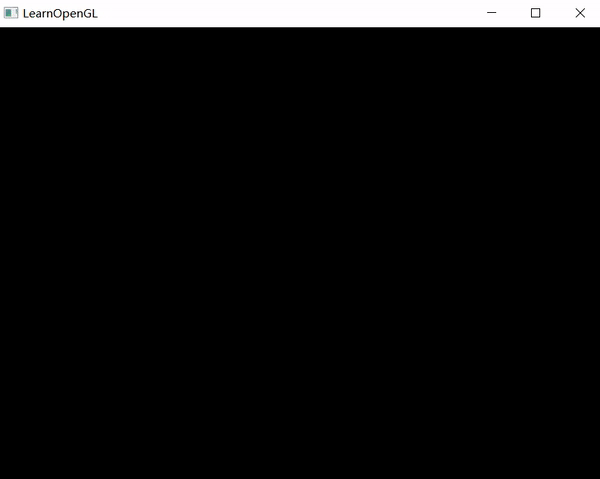

# 计算机图形学 作业八

------

## 一、实验结果



------

## 二、代码实现

- 鼠标移动和鼠标点击回调函数

  ```c++
  void mouse_callback(GLFWwindow* window, double xpos, double ypos) {
  	lastX = xpos;
  	lastY = ypos;
  }
  
  void mouseButtonCallback(GLFWwindow* window, int button, int action, int mods) {
  	if (action == GLFW_PRESS && button == GLFW_MOUSE_BUTTON_LEFT) {
  		// 转化到[-1,1]区间
  		float x = lastX / SCR_WIDTH * 2 - 1;
  		float y = -(lastY / SCR_HEIGHT * 2 - 1);
  		// 增加顶点
  		hw8->addcontrolllPoint(glm::vec2(x, y));
  	}
  	if (action == GLFW_PRESS && button == GLFW_MOUSE_BUTTON_RIGHT) {
  		// 删除最新添加的顶点
  		hw8->deletecontrolllPoint();
  	}
  }
  
  int main() {
      // ...
      
      // 设置回调函数
  	glfwSetCursorPosCallback(window, mouse_callback);
  	glfwSetMouseButtonCallback(window, mouseButtonCallback);
      
      // ...
  }
  ```

- 计算`Bernstein`基函数

  

  ```c++
  float getBernstein(int i, int n, float t) {
  	return factorial[n] / (factorial[i] * factorial[n - i]) * pow(t, i) * pow(1 - t, n - i);
  }
  
  // 其中阶乘数组如下
  factorial[0] = 1;
  for (int i = 1; i < 13; i++) {
  	factorial[i] = i * factorial[i - 1];
  }
  ```

- 计算`Bezier Curve`的参数方程

  

  ```c++
  void generateBezierCurve() {
  	int n = controllVerticesNum - 1;
  	for (float t = 0.0; t < 1.0; t += 0.001) {
  		glm::vec2 temp(0, 0);
  		for (int i = 0; i <= n; i++) {
  			temp += controllVertices[i] * getBernstein(i, n, t);
  		}
  		curvePointsArray[curvePointsNum * 2] = temp.x;
  		curvePointsArray[curvePointsNum * 2 + 1] = temp.y;
  		curvePointsNum++;
  	}
  }
  ```

- 为了体现绘制的过程需要绘制辅助线

  ```c++
  void renderAssistLines(float t) {
  	for (int i = 0; i < controllVerticesNum * 2; i++) {
  		assistVerticesArray[i] = controllVerticesArray[i];
  	}
  
  	for (int i = controllVerticesNum; i > 1; i--) {
  		for (int j = 0; j < i - 1; j++) {
  			// 插值
  			glm::vec2 p1 = glm::vec2(assistVerticesArray[j * 2], assistVerticesArray[j * 2 + 1]);
  			glm::vec2 p2 = glm::vec2(assistVerticesArray[(j + 1) * 2], assistVerticesArray[(j + 1) * 2 + 1]);
  			glm::vec2 p = p1 * (1 - t) + p2 * t;
  
  			assistVerticesArray[j * 2] = p.x;
  			assistVerticesArray[j * 2 + 1] = p.y;
  		}
  		drawAssistLines(i - 1);
  	}
  }
  
  void drawAssistLines(int count) {
  	glGenVertexArrays(1, &assistVAO);
  	glBindVertexArray(assistVAO);
  	glDeleteBuffers(1, &VBO);
  	glGenBuffers(1, &VBO);
  	glBindBuffer(GL_ARRAY_BUFFER, VBO);
  	glBufferData(GL_ARRAY_BUFFER, sizeof(assistVerticesArray), assistVerticesArray, GL_STATIC_DRAW);
  	glVertexAttribPointer(0, 2, GL_FLOAT, GL_FALSE, 2 * sizeof(float), (void*)0);
  	glEnableVertexAttribArray(0);
  
  	glBindVertexArray(assistVAO);
  	glPointSize(10);
  	glDrawArrays(GL_POINTS, 0, count);
  	glDrawArrays(GL_LINE_STRIP, 0, count);
  }
  ```

- 渲染循环

  ```c++
  // 渲染循环
  while (!glfwWindowShouldClose(window)) {
  	// 输入控制
  	processInput(window);
  
  	glClearColor(0.0f, 0.0f, 0.0f, 1.0f);
  	glClear(GL_COLOR_BUFFER_BIT); // 清除颜色缓存
  
  	curvePointsNum = 0;
  
  	// 绘制控制点
  	glGenVertexArrays(1, &controllVAO);
  	glBindVertexArray(controllVAO);
  	glGenBuffers(1, &VBO);
  	glBindBuffer(GL_ARRAY_BUFFER, VBO);
  	glBufferData(GL_ARRAY_BUFFER, sizeof(controllVerticesArray), controllVerticesArray, 	GL_STATIC_DRAW);
  	glVertexAttribPointer(0, 2, GL_FLOAT, GL_FALSE, 2 * sizeof(float), (void*)0);
  	glEnableVertexAttribArray(0);
  			
  	glBindVertexArray(controllVAO);
  	shader.setVec3("pointColor", glm::vec3(1.0f, 1.0f, 1.0f));
  	if (controllVerticesNum > 0) { // 点
  		glPointSize(10);
  		glDrawArrays(GL_POINTS, 0, controllVerticesNum);
  	}
  	if (controllVerticesNum > 1) { // 连线
  		glPointSize(3);
  		glDrawArrays(GL_LINE_STRIP, 0, controllVerticesNum);
  	}
  
  	if (controllVerticesNum > 1) {
  		// 计算贝塞尔曲线
  		generateBezierCurve();
  
  		// 绘制贝塞尔曲线
  		glGenVertexArrays(1, &bezierVAO);
  		glBindVertexArray(bezierVAO);
  		glDeleteBuffers(1, &VBO);
  		glGenBuffers(1, &VBO);
  		glBindBuffer(GL_ARRAY_BUFFER, VBO);
  		glBufferData(GL_ARRAY_BUFFER, sizeof(curvePointsArray), curvePointsArray, 	GL_STATIC_DRAW);
  		glVertexAttribPointer(0, 2, GL_FLOAT, GL_FALSE, 2 * sizeof(float), (void*)0);
  		glEnableVertexAttribArray(0);
  
  		glBindVertexArray(bezierVAO);
  		shader.setVec3("pointColor", glm::vec3(1.0f, 0.0f, 0.0f));
  		glPointSize(3);
  		glDrawArrays(GL_POINTS, 0, curvePointsNum);
  	}
  
  	// 绘制辅助线
  	shader.setVec3("pointColor", glm::vec3(0.0f, 1.0f, 0.5f));
  	frame += 0.001;
  	frame = frame > 1 ? 0 : frame;
  	if (controllVerticesNum == 0) frame = 0;
  	renderAssistLines(frame);
  
  
  	glfwSwapBuffers(window);	// 交换颜色缓冲
  	glfwPollEvents();	// 检查有没有触发什么事件并更新窗口状态
  }
  ```

- 着色器

  ```c++
  // fs
  #version 330 core
  out vec4 FragColor;
  
  uniform vec3 pointColor;
  
  void main()
  {
     FragColor = vec4(pointColor, 1.0f);
  }
  
  // vs
  #version 330 core
  layout (location = 0) in vec2 aPos;
  
  void main()
  {
     gl_Position = vec4(aPos.x, aPos.y, 0.0, 1.0);
  }
  ```

------

